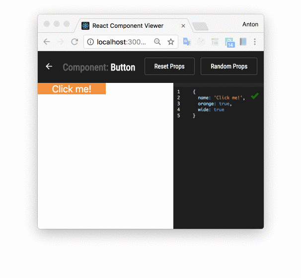

This project was bootstrapped with [Create React App](https://github.com/facebookincubator/create-react-app).


# React Component Viewer

A builder station for your React Components. Create, test and polish up your components!

## Getting Started

1. Fork this GitHub repo by clicking at the Fork button
2. Clone your forked repo

```
git clone git@github.com:<yourusername>/react-component-viewer.git
```

### Installing

```
npm install
```

## Run

```
npm start
```

http://localhost:3000/ will be opened in your browser automatically


## Mock data

Add a file with the following name: `<componentname>.mock.js` and define props for a component:

```
export default {
  name: "Click me!",
  orange: true,
  wide: true,
  clickHandler: () => window.notify("Hey! What's up?")
}
```



## Development

Work on your components in `/src/components` folder

> There are awesome projects for someone who needs more: [React Cosmos](https://github.com/react-cosmos/react-cosmos) and [Storybook](https://github.com/storybooks/storybook)

## License

MIT